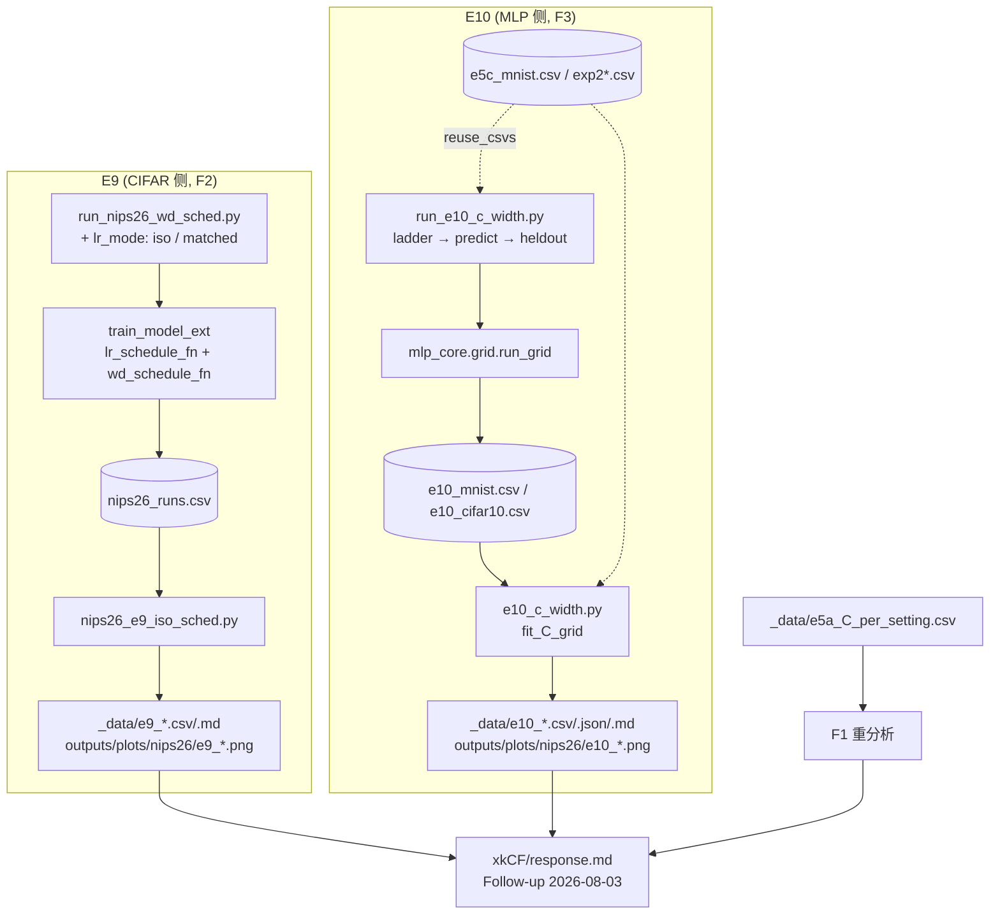

## 用户需求

针对 reviewer xkCF 于 2026-08-03 提出的三点 follow-up（`nips/reviews.md` 501–527 行），在**现有结果基础上**补充两组"短平快"实验并汇报，本轮不处理 SijV 的新 comment（仓库无 LoRA/Qwen 训练代码）。

## 核心内容

### 1. F1 —— Eq.(17) 的经验主张澄清（纯重分析，无新训练）

审稿人指出：Exp.3 施加了固定 `ηλ` 的约束，因此 Eq.(17) 预测的是 `ηλ` 近似常数，而非 `η` 与 `λ` 同时增大；Table 4 也显示 `ηλ` 落在窄区间。需明确回答究竟是 `λ* ∝ B`，还是"仅当 η 固定时才 ∝ B"，并给出把 batch 依赖吸收进 `Σ_t η_t` 后 `C` 的残余漂移（须与现有回复里 1.38 / 1.89 / 1.40 / 1.60 / 1.71 这组数字一致）。

### 2. F2 —— 按审稿人给的两种 scheduler 设计新实验（E9）

审稿人指出现有 joint multiplier 使 `η_t λ_t = η₀λ₀ m(t)²`，**破坏**了论文主张的耦合。据此补两条对照臂，设定与已有 E8 完全对齐（ResNet-18 / CIFAR-100，B=128，η₀=0.1，T=100，SGDM，seed 42）：

- **E9a 等积调度（iso-product）**：`η_t` 走 cosine 退火，`λ_t = λ₀ · η₀/η_t`，使 `η_tλ_t` 全程近似恒定；对 cosine 尾部 `η_t→0` 做上限截断以避免 λ 爆炸。
- **E9b 匹配累积收缩（matched contraction）**：把每种 λ 形状（fixed / cosine / linear / step / iso-product）的 λ₀ 反解，使 `Σ_t η_t λ_t` 精确落在三档预算 `{C/3, C, 3C}`（C 取现有 E4 参考标定值），从而在同一收缩预算下横向可比。

汇报每个 run 的实测 `Σ_t η_t λ_t`（证明等积臂真的恒定、匹配臂真的匹配）与 best test accuracy，并与"cosine LR + 常数 λ"的 oracle（77.28）对照。

### 3. F3 —— held-out C 测试（E10，MLP 宽度阶梯）

审稿人要求：在一个设定上估计 C，用它去**盲预测**另一设定的 λ*，以证明规则真的比二维网格省调参。做法：

- **主线（MNIST + 3 层 MLP，与现有 E5c 同协议）**：在成倍宽度阶梯 `h ∈ {128, 256, 512}`（512 复用现有格子）上分别拟合 `C(h)`，再对 `log C` vs `log h` 做回归得到 C 随宽度的趋势（或判定为"无趋势/常数"）；据此外推、**在跑 oracle 之前先写死预测**，盲预测两个更大 MLP `h ∈ {1024, 2048}` 的 λ*，然后与这两个宽度上真做的 λ oracle 网格对比，报告 `λ_pred/λ_oracle` 比值与 gap（test-loss 与 test-acc 双口径）；同时给出固定默认 λ=5e-4 与 `1/(ηT)` 两条基线在同样 held-out 宽度上的 gap，口径与现有 E4 迁移表一致。
- **交叉验证（CIFAR-10 + 3 层 MLP，与现有 exp2 同协议）**：抽一条宽度阶梯（标定 `h ∈ {256, 512}`，held-out `h = 1024`），仅 SGDM 一条臂，验证 MNIST 上的 C-vs-width 结论是否跨数据集成立。

### 4. 回复写作

在 `xkCF/response.md` 末尾新增 "Follow-up (2026-08-03)" 一节，按 F1/F2/F3 三小节作答，风格与现有 Q1–Q5 一致（英文、直给数字、承认不利结果）；补 `common/` 下 E9/E10 实验笔记、`总览.md` 实验表两行、`PLACEHOLDERS.md` 新 token 登记。本轮不改 `SijV/`、`eC8H/`、`AC_vXFZ/`。

## 边界约束

- 所有数字必须由分析脚本产出，**严禁手工估算**；新数字先落 `_data/`，再进正文。
- 复用现有 runner / CSV schema / 断点续跑与去重逻辑，不另起体系；已有格子能复用的必须复用。
- 只使用 GPU 1,2,3；Python 解释器 `/home/yzy/.conda/envs/trace/bin/python`。
- 不修改已定稿的 E5c/E8 产出逻辑，避免既有 token 被改动。

## 技术栈

沿用仓库现有栈，不引入新依赖：

- PyTorch 2.9.1（`/home/yzy/.conda/envs/trace/bin/python`），`torch.optim.SGD` + 手动 per-epoch 写 `param_groups`
- CIFAR 侧：`wd_core/{data,models,utils,gpu_scheduler,logger}.py` + `rebuttal/run_nips26_wd_sched.py` 的 runner 骨架
- MLP 侧：`mlp_wd/mlp_core/{grid,runner,models,datasets,gpu_scheduler,io}.py`
- 分析：pandas / numpy / matplotlib（Agg），`analysis/nips26_lib.py` 提供 `sum_lr`、`fit_loglog_slope`、`reference_point`、`predict_wd`
- 结果落盘：CSV 增量追加 + 基于 RUN_KEY 的去重续跑

## 实现策略

### 总体思路

两组实验都是"在已有 runner 上加一个调度模式 / 加一条宽度维度"，而不是新建实验体系。E9 复用 `train_model_ext` 已有的 `lr_schedule_fn` / `wd_schedule_fn` 钩子，只新增两个 `lr_mode` 分支；E10 复用 `mlp_core.grid.run_grid` 的断点续跑与 `hidden_dim` 已在去重键内这一事实，直接扫宽度。分析侧各自新增独立脚本，不改动 E5c/E8 既有产出路径，把回归风险压到最小。

### E9：两种新调度模式（CIFAR 侧）

**关键技术决策 1 —— LR 一律由 `lr_schedule_fn` 手动驱动，而非 `CosineAnnealingLR`。**
理由：E9b 要按 `Σ_t η_t m_λ(t)` 反解 λ₀，必须让脚本对每个 epoch 的 `η_e` 有**解析且与训练一致**的取值。`CosineAnnealingLR` 每 epoch step 一次，其 multiplier 恰为 `0.5(1+cos(π t/T))`，与 `wd_multiplier('cosine', ...)` 完全同式；因此改用 `lr_schedule_fn=λ₀→η₀·m_cos(t)` 并传 `scheduler=None`（`train_model_ext` 的文档明确要求，否则二次退火），数值上与既有 cosine 臂一致，同时预算计算与训练严格同源。

**关键技术决策 2 —— iso-product 的截断。**
`λ_t = λ₀·η₀/η_t` 在 cosine 尾部 `m_cos(T-1)≈2.5e-4` 时会把 λ 放大约 4000 倍，必然发散或严重欠拟合。取 `m_floor = 0.1`，即 `λ_t = λ₀ · min(1/m_cos(t), 10)`，等价于对 η 设下限 `η₀/10`。截断倍率写进 `exp` 标签（`e9_iso_k10`）并在报告中显式说明，避免"我们悄悄改了审稿人给的公式"。同时报告实测 `Σ_t η_t λ_t` 与理想恒定值的偏差，让 clip 的代价可见。

**关键技术决策 3 —— matched-contraction 的预算口径与 E4 的 C 严格同源。**
常数 λ 时 `Σ_t η_t λ = λ·S = C`，因此"预算 = C"这一档在 `fixed` 形状下反解出的 λ₀ 恰好等于 `E4_OURS_LAMBDA = 5.982e-4`，与现有 E4/E8 baseline 是同一个格子。据此：`fixed` 形状的 matched 臂直接用 `lr_mode='cosine'` + `wd_sched='fixed'` 发配置，让 `load_done_keys` 命中已存在的 `e8_e4_baseline` 行而跳过重跑（省 1 个 run，且保证与已发布数字逐字一致）。C 通过 `analysis.nips26_lib.reference_point()['C']` 取，不硬编码。

反解公式：给定形状 `m_λ(t)`，`λ₀ = budget / (steps_per_epoch · Σ_e η₀ m_cos(e) m_λ(e))`。三档预算 `{C/3, C, 3C}` 的选择理由：与 E5b/E5c 的 3×/10× 敏感度实验同一"倍数刻度"，且 3× 已被证明是能看出差异但不至于全盘发散的量级；同时能直接回答"是预算决定成败、还是形状决定成败"——这正是 F2 的实质问题。

**规模与成本**：E9a 5 个 λ₀ + E9b 5 形状 × 3 预算 − 1 个复用 = 约 19 个新 run。按 CSV 实测 ResNet-18/T=100 平均 1880 s、GPU 1,2,3 × `workers_per_gpu=2` 并发 6 路，约 1.7–2.5 h，符合"短平快"。

**向后兼容**：`RUN_KEY` 不变，只是 `scheduler` 列新增取值 `iso`；`wd_sched` 新增取值 `iso_product`。`make_cfg` 里 `scheduler` 的白名单元组与 `run_one` 的 `lr_mode` 分派需同步扩展。`ensure_csv_schema` / `load_done_keys` 逻辑无需改动（新行 `wd_sched` 非空，不走 legacy 分支）。

### E10：C 的宽度外推与 held-out 盲测（MLP 侧）

**关键技术决策 1 —— 预测必须先落盘，再跑 oracle。**
F3 的说服力全在"盲"上。runner 分三个阶段、阶段间硬隔断：`ladder` → `predict`（把 `C(h)` 拟合、外推的 `λ_pred` 写入 `_data/e10_predictions.json`，含时间戳与拟合参数）→ `heldout`（跑 λ_pred 单点 + oracle 网格 + 两条基线）。`predict` 阶段若检测到 held-out 宽度的 oracle 行已存在，打印警告说明该预测非盲——保证叙述可核查。

**关键技术决策 2 —— 不改 `run_e5c_c_sensitivity.py`，而是抽一个通用拟合函数到新模块。**
现有 `fit_C_from_phase_b` 把 `C_PROBE_LRS/WDS`、`run_tag` 前缀 `e5cB_`、`MNIST_N` 全部写死，直接改会污染已定稿的 E5c token。新模块实现 `fit_C_grid(df, *, lrs, wds, epochs, batch_size, n, tag_prefix)`，内部 import 复用 `_parabola_trough`（在 log wd 上抛物线求极小，与 E5c 逐字同法）与 `analysis.nips26_lib.sum_lr`，保证 `C` 的定义与 E5a/E5c 完全一致（`C = λ* · Σ_t η_t`，按 `(momentum, lr)` 分组、优先 interior 点、取几何平均）。

**关键技术决策 3 —— 跨 CSV 复用已有格子。**
`run_grid` 的 `filter_completed` 只读自己的 `output_file`，而 h=512 的 MNIST 格子在 `e5c_mnist.csv`、CIFAR-10 的 h=512/1024 格子在 `exp2.csv` / `exp2_sgd.csv`。因此 runner 增加 `--reuse_csvs` 参数：用 `mlp_core.runner.get_task_key` 对这些外部 CSV 建 key 集合，在提交 `run_grid` 前预过滤。这样既不搬动历史数据，也不重复烧卡。复用前须校验 `method` / `momentum` 列（`exp2_sgd.csv` 文件名带 sgd 但需确认实际 momentum，不符则照跑）。

**关键技术决策 4 —— `sum_lr` 的 `n` 必须按数据集传。**
MNIST n=60000、CIFAR-10 n=50000，两条线的 `S` 计算不能共用默认值（默认是 CIFAR-100 的 50000）。所有 `C` 计算显式传 `n`。

**指标口径**：held-out 对比同时报 test-loss gap（MLP 上信噪比更好，与 E5c 一致）与 test-acc gap（与 E4 迁移表一致），并给出 `λ_pred/λ_oracle` 比值——这是"规则省了多少调参"的直接证据（1 个 run vs 15 个网格点）。

**规模与成本**：MNIST 每 run 20 epoch 小 MLP，`workers_per_gpu` 可开到 12。新增约 60（ladder h=128/256）+ 60（held-out oracle h=1024/2048）+ 约 12（λ_pred 与基线单点）≈ 130 个短 run；CIFAR-10 侧 30 epoch、仅 SGDM，约 30–45 个 run。合计数小时内可完成，且与 E9 可并行（E9 占 GPU 大头时错峰跑）。

### F1：纯重分析

不新增训练。基于 `_data/e5a_C_per_setting.csv`（含 B=32…512 五档）与 Exp.3/Table 4，写一个小分析产出两张表：(a) 固定 η 下 `λ*` vs `B` 的 log-log 斜率；(b) 把 B 依赖折叠进 `Σ_t η_t` 后 `C` 随 B 的残余序列。后者必须复现现有回复 Q2 中的 1.38/1.89/1.40/1.60/1.71，若脚本算出不同值，以脚本为准并同步修正 Q2 正文（宁可自己纠正，也不能让审稿人抓到不一致）。

## 架构设计



数据流与现有链路一致：训练 → 追加 CSV → 分析脚本产出 `_data/` 表与 token → 写入 reviewer 回复。

## 目录结构

```
wd/
├── rebuttal/
│   ├── run_nips26_wd_sched.py            # [MODIFY] E8 runner。新增两个 lr_mode:
│   │                                     #   'iso'     —— η_t=η₀·m_cos(t)，λ_t=λ₀·min(1/m_cos(t), K)，K=10
│   │                                     #   'matched' —— λ 形状同 WD_SCHEDULES，λ₀ 由预算反解
│   │                                     # 需改动点：(1) 扩展 make_cfg 里 scheduler 白名单元组，新增 'iso'；
│   │                                     #   matched 的 fixed 形状发 lr_mode='cosine' 以命中已有 e4_baseline 行；
│   │                                     #   (2) run_one 的 lr_mode 分派新增分支，iso/matched 均传 scheduler=None
│   │                                     #   并用 lr_schedule_fn 驱动 cosine；(3) 新增 make_iso_fns() 与
│   │                                     #   solve_lambda0_for_budget(shape, budget, ...)；(4) build_cfgs 新增
│   │                                     #   sweep ∈ {'iso','matched'}，预算取 reference_point()['C'] × {1/3,1,3}；
│   │                                     #   (5) 把每个 cfg 的理论 Σηλ 记入 exp 标签或额外列（不改 RUN_KEY）
│   ├── run_nips26_e9_queue.sh            # [NEW] E9 队列脚本。仿 run_nips26_e8_followup.sh：依次跑
│   │                                     # --sweep iso / --sweep matched（--phase sgdm，GPUS 默认 1,2,3，
│   │                                     # WPG=2），最后调 analysis.nips26_e9_iso_sched，日志落 outputs/logs/
│   └── nips_rebuttal/
│       ├── xkCF/response.md              # [MODIFY] 末尾新增 "## Follow-up (2026-08-03)"，三小节 F1/F2/F3。
│       │                                 # F1 澄清 λ*∝B 的成立条件；F2 给 iso/matched 两张表 + 与 77.28 oracle
│       │                                 # 对照；F3 给 C(h) 斜率、盲预测比值、held-out gap 与两条基线对照。
│       │                                 # 数字用 [[TOKEN]] 占位或从 _data/*_tokens.md 抄录，不手算
│       ├── PLACEHOLDERS.md               # [MODIFY] 登记新 token（E9-*/E10-*）及其 filled-by 来源与状态
│       ├── 总览.md                       # [MODIFY] 第 3 节实验表新增 E9、E10 两行（对应审稿人问题、状态、
│       │                                 # 预算单位）；第 5 节复现命令区补 E9/E10 的运行命令
│       └── common/
│           ├── e9_iso_matched.md         # [NEW] E9 实验笔记。记录设定、两种调度的公式与 clip 参数、预算反解
│           │                             # 推导、结果表、与 E8 joint 臂的对比结论、复现命令与成本
│           └── e10_c_width.md            # [NEW] E10 实验笔记。记录宽度阶梯、C(h) 拟合、盲预测流程（含
│                                         # predictions.json 的时间戳证据）、held-out 结果、CIFAR-10 交叉验证
├── analysis/
│   ├── nips26_e9_iso_sched.py            # [NEW] E9 分析。从 nips26_runs.csv 切 exp∈{e9_iso,e9_matched} 与
│   │                                     # 已有 e8_joint / e8_e4_baseline 对照；重算每个 run 的实测 Σ_t η_t λ_t
│   │                                     # 与 Σ_t η_t；产出 _data/e9_iso_matched.csv、_data/e9_table.md、
│   │                                     # _data/e9_tokens.md，图 outputs/plots/nips26/e9_{iso,matched}.png。
│   │                                     # 表中必须含 shape / budget / λ₀ / 实测 Σηλ / best_acc / Δ vs oracle
│   └── nips26_f1_batch_claim.py          # [NEW] F1 重分析（无新训练）。读 _data/e5a_C_per_setting.csv：
│                                         # (a) 固定 η 下 log λ* vs log B 斜率（fit_loglog_slope）；
│                                         # (b) 折叠进 Σ_t η_t 后 C 随 B 的残余序列（须复现 1.38/1.89/1.40/
│                                         # 1.60/1.71）；产出 _data/f1_batch_claim.md
├── mlp_wd/
│   ├── scripts/
│   │   └── run_e10_c_width.py            # [NEW] E10 runner，三阶段硬隔断（--phases ladder,predict,heldout）。
│   │                                     # ladder: MNIST L=3 h∈{128,256,512}，C_PROBE_LRS×C_PROBE_WDS，
│   │                                     #   SGD+SGDM，20 epoch/B=128/cosine，run_tag 前缀 e10L_
│   │                                     # predict: 调 fit_C_grid 得 C(h)，log-log 外推 h∈{1024,2048}，
$   │                                     #   把 λ_pred/拟合参数/时间戳写 _data/e10_predictions.json；若
│   │                                     #   held-out oracle 已存在则打印非盲警告
│   │                                     # heldout: h∈{1024,2048} 跑 λ_pred 单点 + oracle 网格 + 基线
│   │                                     #   (λ=5e-4, λ=1/(ηT))，run_tag 前缀 e10H_
│   │                                     # 另有 --dataset cifar10 分支：L=3/30 epoch/B=128/仅 SGDM，
│   │                                     #   ladder h∈{256,512}、held-out h=1024
│   │                                     # 新增 --reuse_csvs：用 mlp_core.runner.get_task_key 对
│   │                                     #   e5c_mnist.csv / exp2.csv / exp2_sgd.csv 建 key 集合预过滤，
│   │                                     #   复用前校验 method/momentum 一致
│   ├── analysis/
│   │   └── e10_c_width.py                # [NEW] E10 分析。实现通用 fit_C_grid(df, *, lrs, wds, epochs,
│   │                                     # batch_size, n, tag_prefix)，复用 run_e5c 的 _parabola_trough 与
│   │                                     # nips26_lib.sum_lr（n 按数据集传：MNIST 60000 / CIFAR-10 50000）；
│   │                                     # 产出 _data/e10_c_width.csv、_data/e10_heldout_table.md、
│   │                                     # _data/e10_tokens.md，图 outputs/plots/nips26/e10_c_width.png
│   │                                     # （左：C vs h 阶梯+外推；中：λ_pred vs λ_oracle；右：gap 对比柱状）
│   └── outputs/results/
│       ├── e10_mnist.csv                 # [NEW] E10 MNIST 结果（schema 沿用 mlp_core.runner.CSV_FIELDS）
│       └── e10_cifar10.csv               # [NEW] E10 CIFAR-10 交叉验证结果
└── rebuttal/nips_rebuttal/_data/
    ├── e9_iso_matched.csv                # [NEW] E9 逐 run 明细（含实测 Σηλ）
    ├── e9_table.md / e9_tokens.md        # [NEW] E9 汇总表与 token
    ├── f1_batch_claim.md                 # [NEW] F1 重分析结论表
    ├── e10_c_width.csv                   # [NEW] 各宽度拟合出的 C 与 λ*
    ├── e10_predictions.json              # [NEW] 盲预测证据（λ_pred、拟合参数、时间戳）
    └── e10_heldout_table.md / e10_tokens.md  # [NEW] held-out gap 表与 token
```

## 关键接口

```python
# rebuttal/run_nips26_wd_sched.py 新增
ISO_M_FLOOR = 0.1  # λ_t = λ0 * min(1/m_cos(t), 1/ISO_M_FLOOR)

def make_iso_fns(lr0: float, lambda0: float, epochs: int,
                 m_floor: float = ISO_M_FLOOR): ...
    """返回 (lr_fn, wd_fn)：η_t=lr0*m_cos(t)，λ_t=lambda0*min(1/m_cos(t), 1/m_floor)。"""

def contraction_sum(lr0: float, lambda0: float, epochs: int, batch_size: int,
                    wd_sched: str, lr_mode: str) -> float: ...
    """训练同源地累加 Σ_t η_t λ_t（逐 epoch 乘 steps_per_epoch）。"""

def solve_lambda0_for_budget(budget: float, lr0: float, epochs: int,
                             batch_size: int, wd_sched: str) -> float: ...
    """令 contraction_sum(...) == budget，反解 λ0（形状线性于 λ0，故为一次除法）。"""

# mlp_wd/analysis/e10_c_width.py 新增
def fit_C_grid(df, *, lrs, wds, epochs, batch_size, n, tag_prefix=None,
               metric="best_test_loss"): ...
    """按 (momentum, lr) 分组拟合 λ*（log-wd 抛物线），返回 (optima_df, C_by_momentum)。
    C = λ* · sum_lr(lr, epochs, batch_size, 'cosine', n=n)，几何平均、优先 interior 点。"""
```

## 执行注意事项

- **GPU 与并发**：只用 `--gpus 1,2,3`。E9（ResNet-18）`workers_per_gpu=2`；E10（小 MLP）可开 `workers_per_gpu=12`、`loader_workers=0`。两者不要同时满载。
- **不要二次退火**：iso/matched 模式下用 `lr_schedule_fn` 驱动 LR 时必须传 `scheduler=None`，否则与 `CosineAnnealingLR` 叠加。
- **续跑与去重**：所有新 sweep 都要经 `load_done_keys` / `filter_completed`；中断可直接重跑。`matched` 的 `fixed`×`C` 档应命中已有 `e8_e4_baseline` 行，若未命中说明 λ₀ 反解口径与 `E4_OURS_LAMBDA` 不一致，需先排查再开跑。
- **发散处理**：iso 臂在大 λ₀ 下可能发散，沿用 `DIVERGENCE_LOSS_THRESHOLD` 与 `divergence_check_epoch=3`，发散行照实写入并在表中标注，不要剔除。
- **数字纪律**：正文数字一律来自 `_data/` 下脚本产出；新 token 先登记 `PLACEHOLDERS.md`。E10 沿用 E5c 先例（自带 `e10_tokens.md`），避免改动 `nips26_report.py` 的既有 token 列表引发回归。
- **爆炸半径**：不改 `run_e5c_c_sensitivity.py`、`nips26_e8_wd_sched.py` 的既有输出路径与逻辑；不动 `SijV/`、`eC8H/`、`AC_vXFZ/` 三份回复。
- **F1 一致性**：若重分析算出的残余序列与 Q2 正文的 1.38/1.89/1.40/1.60/1.71 不符，以脚本为准并同步修正 Q2，不得两处并存不同数字。