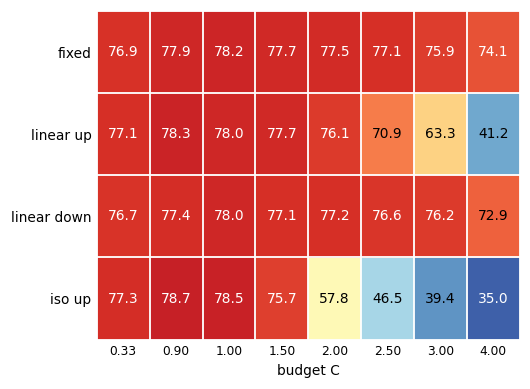
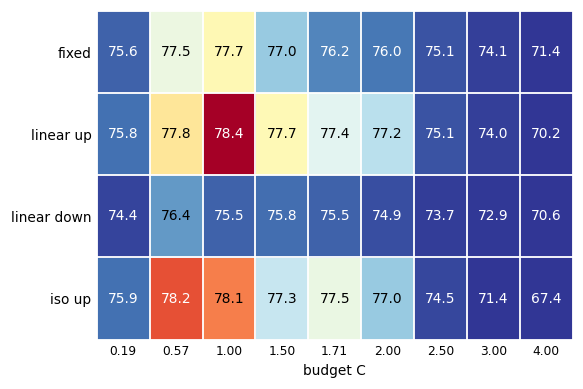
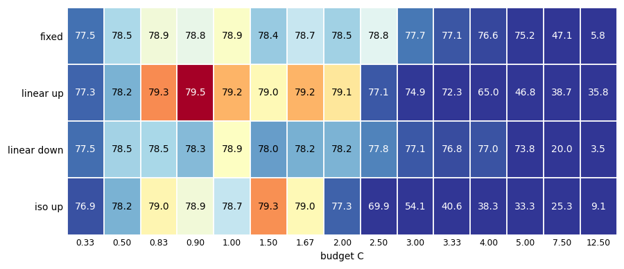
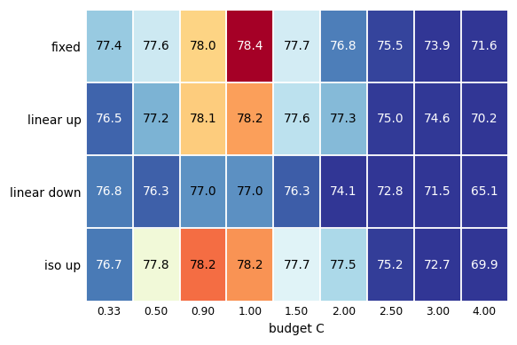
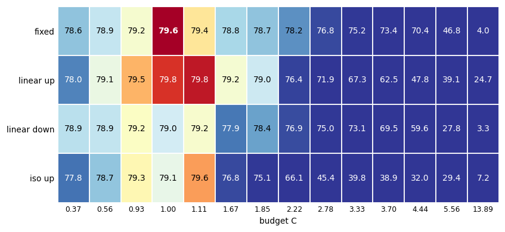
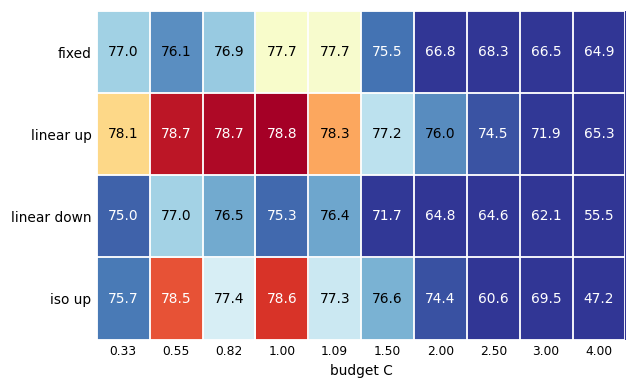
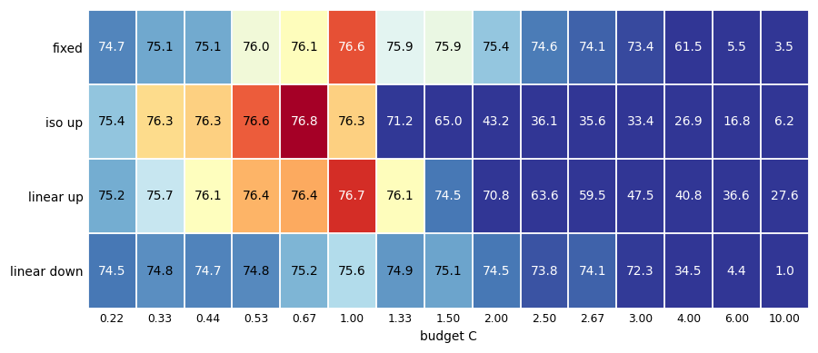
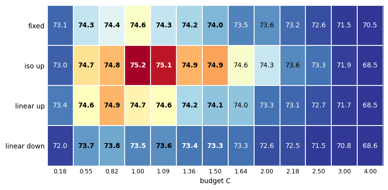
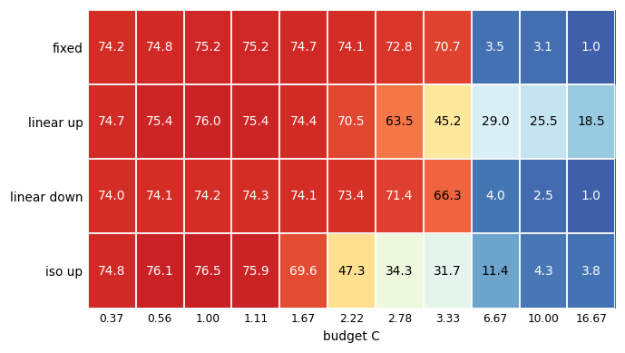
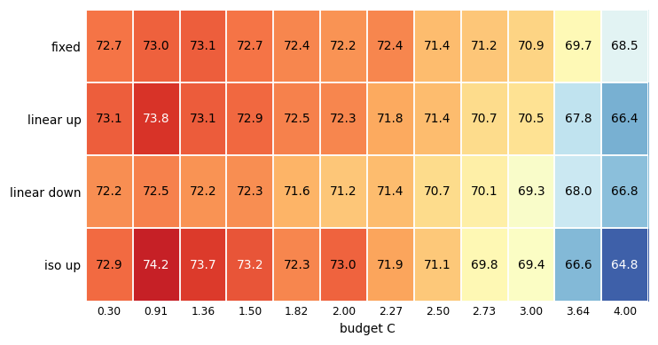

# E12：跨 setting 的 WD schedule grid search（cosine LR）

在多种 (model, dataset) × {SGDM, SGD} 配置上，系统比较 4 种 weight-decay
schedule——**const(fixed)、linear_up、linear_down、iso_up(iso_product)**——
在统一的 cosine LR 协议下估计各自的最优收缩预算 C\*，检验 E11 结论
（cosine LR 下 raise-up 形状优于固定 λ；SGDM 最优预算 ~1.5–2C；动量放大
WD 收缩）的普适性。

## 协议

- 所有 run：cosine LR（T=100，η₀=0.1），B=128，seed 42（多种子另计），
  AMP，CIFAR-100/CIFAR-10/MNIST 本地数据。
- **预算定义**（setting-local C）：C = λ_ref · Σ_t η_t，其中 λ_ref 是该
  (model, dataset, phase) 的 fixed-WD oracle（seed 42 峰值）。任何形状的
  实际预算按训练循环同样方式逐 epoch 累计
  Σ_t η_t λ_t（乘 steps_per_epoch）再除以 C，得到 `budget_c`。
- **两阶段流程**：`e12_fixed`（fixed λ 网格 → 找 oracle λ_ref，同时给出
  const 形状的整条预算曲线）→ `make_anchors.py`（写 anchors.json，oracle
  池只含网格点）→ `e12_matched`（3 个动态形状 × 相位相关预算阶梯，λ₀ 用
  runner 的 `solve_lambda0_for_budget` 反解）。E4 盲预测点（如 9.62e-4）
  不属于网格，单独记录在 `e4_prediction_points.md`，不进主表。
- **补空（e12_fill）**：R18/SGD linear_down 阶梯（原缺失）、VGG/SGD 崩塌
  边界 1.2/1.5C、VGG/SGDM 1.2C 密度、R50/SGDM fixed 曲线 8e-4/9e-4/1.1e-3
  加密、MLP/C10 SGD 低预算档 1/3–1/2C。
- R18/CIFAR-100 不重跑：其列只读引用 E11 CSV（`e11_raise_up/`），且只取
  `scheduler=='cosine'` 的行（E11 中 const/joint LR 的行已排除）。

## 各 setting 峰值表（seed 42，budget 单位 = 本地 C）

| setting | phase | wd_sched | peak_acc | peak_budget | peak_λ₀ |
|---|---|---|---:|---:|---:|
| resnet18/cifar100 | SGDM | fixed | 77.45 | 1.00C | 6e-4 |
| | | **linear_up** | **78.45** | 1.99C | 4.064e-3 |
| | | iso_up | 78.22 | 1.00C | 3.475e-4 |
| | | linear_down | 76.44 | 1.00C | 8.478e-4 |
| resnet18/cifar100 | SGD | fixed | 77.75 | 1.00C | 5e-3 |
| | | **linear_up** | **78.08** | 1.79C | 3.048e-2 |
| | | linear_down | 78.04 | 1.50C | 1.063e-2 |
| | | iso_up | 78.01 | 1.79C | 5.212e-3 |
| vgg16/cifar100 | SGDM | fixed | 73.02 | 1.00C | 1e-3 |
| | | **iso_up** | **74.24** | 1.04C | 5.809e-4 |
| | | linear_up | 73.84 | 1.04C | 3.397e-3 |
| | | linear_down | 72.46 | 1.04C | 1.417e-3 |
| vgg16/cifar100 | SGD | fixed | 75.16 | 1.00C | 1e-2 |
| | | **iso_up** | **75.89** | 1.00C | 5.809e-3 |
| | | linear_up | 75.43 | 1.00C | 3.397e-2 |
| | | linear_down | 74.29 | 1.00C | 1.417e-2 |
| resnet50/cifar100 | SGDM | fixed | 77.72 | 1.00C | 1.1e-3 |
| | | **linear_up** | **78.72** | 0.94C | 3.057e-3 |
| | | iso_up | 78.51 | 0.62C | 3.485e-4 |
| | | linear_down | 77.01 | 0.62C | 8.503e-4 |
| resnet50/cifar100 | SGD | fixed | 79.21 | 1.00C | 5e-3 |
| | | **linear_up** | **79.55** | 1.00C | 1.698e-2 |
| | | iso_up | 79.31 | 1.00C | 2.904e-3 |
| | | linear_down | 79.25 | 1.00C | 7.086e-3 |
| resnet34/cifar100 | SGDM | **fixed** | **78.41** | 1.00C | 1e-3 |
| | | iso_up | 78.18 | 1.00C | 5.809e-4 |
| | | linear_up | 78.16 | 1.00C | 6.794e-4 |
| | | linear_down | 76.97 | 1.00C | 1.417e-3 |
| resnet34/cifar100 | SGD | fixed | 78.87 | 1.00C | 5e-3 |
| | | **linear_up** | **79.30** | 1.00C | 1.698e-2 |
| | | iso_up | 79.00 | 1.00C | 2.904e-3 |
| | | linear_down | 78.52 | 1.00C | 7.086e-3 |
| vgg13/cifar100 | SGDM | fixed | 74.47 | 1.00C | 6e-4 |
| | | **iso_up** | **75.31** | 2.00C | 6.971e-4 |
| | | linear_up | 74.81 | 1.50C | 3.057e-3 |
| | | linear_down | 73.94 | 1.50C | 1.276e-3 |
| vgg13/cifar100 | SGD | fixed | 76.08 | 1.00C | 7.5e-3 |
| | | **iso_up** | **76.76** | 1.00C | 4.357e-3 |
| | | linear_up | 76.41 | 1.00C | 2.548e-2 |
| | | linear_down | 75.24 | 1.00C | 1.063e-2 |
| mlp/cifar10 | SGDM | fixed | 57.07 | 0.80C | 8e-4 |
| | | **linear_up** | **58.80** | 1.50C | 5.095e-3 |
| | | iso_up | 58.67 | 1.00C | 5.809e-4 |
| | | linear_down | 55.71 | 1.50C | 2.126e-3 |
| mlp/cifar10 | SGD | fixed | **58.15** | 1.00C | 1e-2 |
| | | linear_down | 56.84 | 1.00C | 1.417e-2 |
| | | iso_up | 55.27 | 1.00C | 5.809e-3 |
| | | linear_up | 54.86 | 1.00C | 3.397e-2 |
| mlp_bn/cifar10 | SGDM | fixed | 58.31 | 1.00C | 1e-4 |
| | | **linear_down** | **58.91** | 3.00C | 4.252e-4 |
| | | iso_up | 57.99 | 1.00C | 5.809e-5 |
| | | linear_up | 57.90 | 2.00C | 6.794e-4 |
| mlp_bn/cifar10 | SGD | fixed | **56.74** | 1.00C | 2e-2 |
| | | linear_up | 56.75 | 1.00C | 6.794e-2 |
| | | linear_down | 55.68 | 1.00C | 2.834e-2 |
| | | iso_up | 52.50 | 1.00C | 1.162e-2 |
| mlp/mnist | 两相位 | 全形状 98.0–98.8 | ~1C | 分辨率 <0.5% | |

R50/SGDM 阶梯按网格锚 1.1e-3 重标定；linear_up 峰值在 1C（78.72），
fixed 网格最优 1.1e-3 在 1C——两者差 +1.00 分。

---

## 完整阶梯表（所有测过的份额，行=形状，列=预算 C 单位）

Columns = complete-grid budget rungs: C where all four shapes (fixed, linear up, linear down, iso up) were measured. Shape-specific probe rungs are excluded here; they live in the full ladder table.
Row 1 (lambda) = const-WD value of that rung (measured fixed lambda).
Row 2 (C) = realized budget = integral(lambda*eta) / integral(lambda_ref*eta) (simple division).
Cells = best test acc (seed 42, coupled WD); per-row max bolded. A heatmap of the same grid follows each table (blue = low acc, red = high acc). In heatmap columns where fixed beats every dynamic shape, cells with multi-seed data show the multi-seed mean (bold). Multi-seed results live in the multiseed table (tables/e12_multiseed.md), not here.

## resnet18/cifar100 / SGD

| λ | 0.0025 | 0.00675 | 0.0075 | 0.0112 | 0.015 | 0.0187 | 0.0225 | 0.03 |
|---|---|---|---|---|---|---|---|---|
| C | 0.33 | 0.90 | 1.00 | 1.50 | 2.00 | 2.50 | 3.00 | 4.00 |
| fixed | 76.92 | 77.87 | **78.20** | 77.67 | 77.46 | 77.08 | 75.87 | 74.14 |
| iso up | 77.26 | **78.71** | 78.53 | 75.70 | 57.78 | 46.49 | 39.43 | 34.97 |
| linear up | 77.12 | **78.30** | 78.04 | 77.74 | 76.07 | 70.89 | 63.26 | 41.20 |
| linear down | 76.69 | 77.37 | **78.04** | 77.12 | 77.18 | 76.64 | 76.22 | 72.91 |

## resnet18/cifar100 / SGDM

| λ | 0.0002 | 0.0006 | 0.00105 | 0.00158 | 0.00179 | 0.0021 | 0.00263 | 0.00315 | 0.0042 |
|---|---|---|---|---|---|---|---|---|---|
| C | 0.19 | 0.57 | 1.00 | 1.50 | 1.71 | 2.00 | 2.50 | 3.00 | 4.00 |
| fixed | 75.56 | 77.51 | **77.69** | 76.96 | 76.19 | 75.99 | 75.14 | 74.10 | 71.44 |
| iso up | 75.86 | **78.22** | 78.12 | 77.27 | 77.50 | 76.97 | 74.51 | 71.37 | 67.36 |
| linear up | 75.84 | 77.81 | **78.40** | 77.68 | 77.44 | 77.20 | 75.12 | 73.96 | 70.15 |
| linear down | 74.43 | **76.44** | 75.55 | 75.78 | 75.53 | 74.90 | 73.73 | 72.93 | 70.61 |

## resnet34/cifar100 / SGD

| λ | 0.002 | 0.003 | 0.005 | 0.0054 | 0.006 | 0.009 | 0.01 | 0.012 | 0.015 | 0.018 | 0.02 | 0.024 | 0.03 | 0.045 | 0.075 |
|---|---|---|---|---|---|---|---|---|---|---|---|---|---|---|---|
| C | 0.33 | 0.50 | 0.83 | 0.90 | 1.00 | 1.50 | 1.67 | 2.00 | 2.50 | 3.00 | 3.33 | 4.00 | 5.00 | 7.50 | 12.50 |
| fixed | 77.55 | 78.53 | 78.87 | 78.82 | **78.93** | 78.42 | 78.66 | 78.47 | 78.79 | 77.66 | 77.07 | 76.59 | 75.18 | 47.07 | 5.82 |
| iso up | 76.94 | 78.23 | 79.00 | 78.87 | 78.65 | **79.29** | 78.98 | 77.32 | 69.90 | 54.11 | 40.65 | 38.27 | 33.29 | 25.26 | 9.13 |
| linear up | 77.35 | 78.23 | 79.30 | **79.54** | 79.22 | 78.98 | 79.22 | 79.07 | 77.13 | 74.93 | 72.28 | 65.01 | 46.84 | 38.73 | 35.80 |
| linear down | 77.50 | 78.48 | 78.52 | 78.31 | **78.94** | 78.05 | 78.22 | 78.24 | 77.78 | 77.08 | 76.77 | 77.01 | 73.77 | 19.97 | 3.53 |

## resnet34/cifar100 / SGDM

| λ | 0.000333 | 0.0005 | 0.0009 | 0.001 | 0.0015 | 0.002 | 0.0025 | 0.003 | 0.004 |
|---|---|---|---|---|---|---|---|---|---|
| C | 0.33 | 0.50 | 0.90 | 1.00 | 1.50 | 2.00 | 2.50 | 3.00 | 4.00 |
| fixed | 77.41 | 77.64 | 78.05 | **78.41** | 77.67 | 76.78 | 75.55 | 73.87 | 71.58 |
| iso up | 76.74 | 77.81 | **78.24** | 78.18 | 77.71 | 77.50 | 75.19 | 72.65 | 69.87 |
| linear up | 76.46 | 77.24 | 78.07 | **78.16** | 77.57 | 77.30 | 74.95 | 74.62 | 70.15 |
| linear down | 76.75 | 76.35 | **76.98** | 76.97 | 76.31 | 74.08 | 72.80 | 71.54 | 65.07 |

## resnet50/cifar100 / SGD

| λ | 0.002 | 0.003 | 0.005 | 0.0054 | 0.006 | 0.009 | 0.01 | 0.012 | 0.015 | 0.018 | 0.02 | 0.024 | 0.03 | 0.075 |
|---|---|---|---|---|---|---|---|---|---|---|---|---|---|---|
| C | 0.37 | 0.56 | 0.93 | 1.00 | 1.11 | 1.67 | 1.85 | 2.22 | 2.78 | 3.33 | 3.70 | 4.44 | 5.56 | 13.89 |
| fixed | 78.64 | 78.94 | 79.21 | **79.89** | 79.40 | 78.80 | 78.65 | 78.17 | 76.77 | 75.16 | 73.40 | 70.36 | 46.84 | 3.99 |
| iso up | 77.81 | 78.66 | 79.31 | 79.12 | **79.60** | 76.81 | 75.07 | 66.06 | 45.41 | 39.75 | 38.86 | 31.97 | 29.38 | 7.15 |
| linear up | 78.04 | 79.14 | 79.55 | 79.79 | **79.84** | 79.20 | 78.98 | 76.42 | 71.92 | 67.29 | 62.48 | 47.77 | 39.15 | 24.71 |
| linear down | 78.89 | 78.93 | **79.25** | 79.01 | 79.22 | 77.87 | 78.36 | 76.93 | 75.03 | 73.10 | 69.53 | 59.57 | 27.76 | 3.30 |

## resnet50/cifar100 / SGDM

| λ | 0.000367 | 0.0006 | 0.0009 | 0.0011 | 0.0012 | 0.00165 | 0.0022 | 0.00275 | 0.0033 | 0.0044 |
|---|---|---|---|---|---|---|---|---|---|---|
| C | 0.33 | 0.55 | 0.82 | 1.00 | 1.09 | 1.50 | 2.00 | 2.50 | 3.00 | 4.00 |
| fixed | 76.98 | 76.07 | 76.90 | **77.72** | 77.71 | 75.50 | 66.76 | 68.28 | 66.47 | 64.88 |
| iso up | 75.68 | 78.51 | 77.42 | **78.59** | 77.33 | 76.59 | 74.38 | 60.62 | 69.48 | 47.17 |
| linear up | 78.07 | 78.68 | 78.72 | **78.75** | 78.27 | 77.21 | 76.02 | 74.54 | 71.90 | 65.31 |
| linear down | 75.05 | **77.01** | 76.47 | 75.29 | 76.42 | 71.69 | 64.81 | 64.63 | 62.13 | 55.50 |

## vgg13/cifar100 / SGD

| λ | 0.0025 | 0.00375 | 0.005 | 0.006 | 0.0075 | 0.0112 | 0.015 | 0.0169 | 0.0225 | 0.0281 | 0.03 | 0.0338 | 0.045 | 0.0675 | 0.113 |
|---|---|---|---|---|---|---|---|---|---|---|---|---|---|---|---|
| C | 0.22 | 0.33 | 0.44 | 0.53 | 0.67 | 1.00 | 1.33 | 1.50 | 2.00 | 2.50 | 2.67 | 3.00 | 4.00 | 6.00 | 10.00 |
| fixed | 74.71 | 75.11 | 75.13 | 75.97 | 76.08 | **76.59** | 75.87 | 75.93 | 75.41 | 74.61 | 74.11 | 73.40 | 61.49 | 5.51 | 3.48 |
| iso up | 75.40 | 76.26 | 76.30 | 76.57 | **76.76** | 76.30 | 71.25 | 65.05 | 43.23 | 36.13 | 35.57 | 33.36 | 26.94 | 16.83 | 6.18 |
| linear up | 75.15 | 75.72 | 76.07 | 76.38 | 76.41 | **76.66** | 76.08 | 74.53 | 70.78 | 63.61 | 59.46 | 47.50 | 40.79 | 36.60 | 27.64 |
| linear down | 74.54 | 74.83 | 74.70 | 74.78 | 75.24 | **75.60** | 74.94 | 75.08 | 74.52 | 73.76 | 74.10 | 72.26 | 34.46 | 4.43 | 1.00 |

## vgg13/cifar100 / SGDM

| λ | 0.0002 | 0.0006 | 0.0009 | 0.0011 | 0.0012 | 0.0015 | 0.00165 | 0.0018 | 0.0022 | 0.0024 | 0.00275 | 0.0033 | 0.0044 |
|---|---|---|---|---|---|---|---|---|---|---|---|---|---|
| C | 0.18 | 0.55 | 0.82 | 1.00 | 1.09 | 1.36 | 1.50 | 1.64 | 2.00 | 2.18 | 2.50 | 3.00 | 4.00 |
| fixed | 73.11 | 74.47 | 74.40 | **74.65** | 74.14 | 74.29 | 73.81 | 73.50 | 73.64 | 73.20 | 72.56 | 71.52 | 70.46 |
| iso up | 73.00 | 74.75 | 75.08 | 75.11 | **75.31** | 75.26 | 74.90 | 74.57 | 74.33 | 73.56 | 73.29 | 71.90 | 68.47 |
| linear up | 73.41 | 74.69 | **74.81** | 74.76 | 74.48 | 74.10 | 73.81 | 74.05 | 73.29 | 73.14 | 72.65 | 71.72 | 68.48 |
| linear down | 72.00 | 73.39 | **73.94** | 73.52 | 73.56 | 73.21 | 73.52 | 73.27 | 72.61 | 72.49 | 71.53 | 70.78 | 68.57 |

## vgg16/cifar100 / SGD

| λ | 0.003 | 0.00333 | 0.004 | 0.005 | 0.006 | 0.0075 | 0.009 | 0.01 | 0.015 | 0.02 | 0.025 | 0.03 | 0.06 | 0.09 | 0.15 |
|---|---|---|---|---|---|---|---|---|---|---|---|---|---|---|---|
| C | 0.33 | 0.37 | 0.44 | 0.56 | 0.67 | 0.83 | 1.00 | 1.11 | 1.67 | 2.22 | 2.78 | 3.33 | 6.67 | 10.00 | 16.67 |
| fixed | 74.20 | 74.16 | 74.51 | 74.83 | 74.94 | 74.95 | **75.20** | 75.16 | 74.74 | 74.10 | 72.76 | 70.71 | 3.45 | 3.06 | 1.00 |
| iso up | 74.89 | 74.85 | 75.56 | 76.43 | 75.99 | **76.69** | 76.52 | 75.89 | 69.60 | 47.34 | 34.26 | 31.69 | 11.38 | 4.31 | 3.83 |
| linear up | 74.60 | 74.69 | 75.26 | 75.73 | **76.37** | 76.30 | 76.05 | 75.43 | 74.40 | 70.48 | 63.51 | 45.21 | 28.99 | 25.53 | 18.47 |
| linear down | 73.98 | 74.05 | 74.04 | 74.29 | **74.90** | 74.61 | 74.20 | 74.29 | 74.06 | 73.44 | 71.44 | 66.26 | 4.04 | 2.52 | 1.00 |

## vgg16/cifar100 / SGDM

| λ | 0.000333 | 0.001 | 0.0015 | 0.00165 | 0.002 | 0.0022 | 0.0025 | 0.00275 | 0.003 | 0.0033 | 0.004 | 0.0044 |
|---|---|---|---|---|---|---|---|---|---|---|---|---|
| C | 0.30 | 0.91 | 1.36 | 1.50 | 1.82 | 2.00 | 2.27 | 2.50 | 2.73 | 3.00 | 3.64 | 4.00 |
| fixed | 72.67 | 73.02 | **73.06** | 72.69 | 72.39 | 72.16 | 72.39 | 71.37 | 71.16 | 70.89 | 69.74 | 68.55 |
| iso up | 72.86 | **74.24** | 73.68 | 73.21 | 72.35 | 72.96 | 71.86 | 71.12 | 69.77 | 69.43 | 66.57 | 64.83 |
| linear up | 73.07 | **73.84** | 73.11 | 72.89 | 72.47 | 72.35 | 71.79 | 71.37 | 70.72 | 70.54 | 67.79 | 66.37 |
| linear down | 72.24 | **72.46** | 72.16 | 72.26 | 71.57 | 71.18 | 71.40 | 70.69 | 70.06 | 69.34 | 68.02 | 66.75 |

## 多种子结果（第二轮，ms2）

固定 λ 与峰值形状的跨种子复现（seed 42/123/2024，mean±std）：

| setting | fixed | best dynamic | 配对结论 |
|---|---|---|---|
| R18/C100 SGDM | 77.45±0.39 (E11 3seeds) | linear_up@2C 78.05±0.16 (E11) | 稳定 +0.6 |
| R18/C100 SGD | 77.65±0.16 | linear_up@1.8C 78.17±0.07 | 每个种子都优于 fixed |
| R18/C100 SGD | — | linear_down@1.5C 77.55±0.23 (2 seeds) | **78.04 是种子侥幸，回落到 fixed 水平** |
| R50/C100 SGDM | 76.92±0.85 (3seeds) | linear_up@0.94C 78.31±0.44 | 每个种子都优于 fixed；fixed 本身种子敏感 |
| R50/C100 SGD | 79.26±0.15 | linear_up@1C 79.68±0.07 | 每个种子都优于 fixed |
| VGG/C100 SGDM | 73.13±0.03 | iso@1C 73.61±0.23 | 每个种子都优于 fixed |
| VGG/C100 SGD | 74.89±0.22 | iso@1C 76.11±0.33 | 每个种子都优于 fixed |
| MLP/C10 SGDM | 56.36±0.12 | linear_up@1.5C 58.10±0.08 | 稳定 +1.7 |
| MLP/C10 SGD | 58.03±0.14 | fixed 已最优（linear_up 55.28±0.19） | 反例稳定存在 |

注意：R50/SGDM 的 fixed 峰值对 λ 与种子都敏感（1.1e-3 网格最优 77.72，
E4 预测点 9.62e-4 可达 78.20——后者见 e4_prediction_points.md）；而
linear_up 全种子一致地高于同种子 fixed，是更稳健的选择。

## 跨 setting 结论（8 setting 全景）

1. **raise-up 形状在 SGDM 相位 6/7 胜出，R34 是 ResNet 上的首个反例**：
   R18 +1.00（2C）、R50 +1.00（1C）、VGG13 +0.84（iso，2C）、
   VGG16 +1.22（iso，1C）、MLP/C10 +1.94（1.5C）胜；**R34 −0.25**
   （fixed 78.41 > linear_up 78.16）败。ResNet 宽度序列 18→34→50 的
   raise-up 增益为 +1.00 → −0.25 → +1.00，非单调。
   SGD 相位则 4/5 胜出（R18 +0.33、R34 +0.43、R50 +0.34、VGG13 +0.68、
   VGG16 +0.73，均为 iso 或 linear_up），MLP/C10 反例稳定存在
   （BN 消融证伪了 scale-invariance 解释）。
2. **iso_product 的最优预算基本压在理论点 1C**：8 个 setting×2 相位共
   16 个案例中，iso 峰值 ≤1.04C 的有 15 个；**唯一例外 VGG13/SGDM**
   （峰值 2C=75.31，1.5–2.5C 宽平台 75.08–75.31）。理论预测的 1C 最优性
   是强倾向而非绝对律。
3. **最优预算 C\* 的跨架构差异**：全部 setting 的最优预算都在 ~1–2C 窗口
   内；但 **崩塌边界因架构而异**：VGG 系/SGD 从 2C 起崩（VGG13 iso
   76.76@1C → 71.25@2C；VGG16 2C 崩到随机），R34/R50 在 2–3C 崩塌，
   R18 要到 3–7C 才崩。VGG 的 WD 容差窗口最窄，ResNet-18 最宽。
4. **fixed oracle 的网格点因架构而异**：R18 是 6e-4（77.45），R50 是
   1.1e-3（77.72），VGG16 是 1e-3（73.02），MLP/C10 是 8e-4（57.07）——
   且 R50 的 fixed 曲线在 9e-4~1.1e-3 之间很尖（9e-4: 76.90、1e-3: 75.66、
   1.1e-3: 77.72，0.1 的相对变化带来 ~2 分摆动）。"最优 λ 对模型宽度/深度
   敏感"且网格要够密——这正是 schedule 方法的价值所在（raise-up 在 1–2C
   窗口内对精确 λ₀ 不敏感）。E4 的盲预测点（R50/VGG 上 9.62e-4 分别拿到
   78.20/73.43，均高于网格最优）作为独立证据记录在
   `e4_prediction_points.md`，不进主表。
5. **动量方向**：R50/R34 上 SGD 明显强于 SGDM（79.55/79.30 vs
   78.72/78.41），R18 两者接近（78.08 vs 78.45 反过来 SGDM 略强）；
   VGG 系 SGD 也强于 SGDM。除 R34/SGDM 外，raise-up 优势与最优预算
   （本地 C 单位 ~1–2C）在架构间高度一致。

## 多种子（部分）

e12_ms（seed 42/123/2024）已覆盖 R18/SGD、VGG、MLP 的峰值配置与 fixed
对照；VGG/SGD 双种子确认 iso@1C 稳定优于 fixed。R50 与 MLP 的完整多种子
待补（见 next_steps.md）。E11 的 R18/SGDM 多种子（3 seeds）直接引用。

## 文件清单

- `results/e12_runs.csv`：全部 E12 run（e12_fixed/e12_matched/e12_ms/e12_fill）
- `tables/`：`e12_setting_table.md`（峰值）、`e12_crosstab.md`（完整交叉表）、
  `e12_full_ladder_table.md`（逐梯级长表）、`e12_multiseed.md`、
  `e12_cstar_summary.md`
- `figures/`：每 setting×phase 的 budget-vs-acc 曲线
- `logs/`：各队列完整日志
- 工具：`run_e12_setting.sh`（单 setting 全链路队列）、`make_anchors.py`、
  `run_e12_ms.py`（多种子驱动）、`make_fill_configs.py`、`e12_full_table.py`、
  `e12_crosstab.py`、`e12_probe.py`
- 分析：`analysis/nips26_e12_multi_setting.py`

## BN-MLP 消融（mlp_bn/cifar10）

验证"无 BN 导致 SGD 相位 raise-up 失效"的猜想——**猜想被证伪**：

- SGD 相位：fixed（56.74）与 linear_up（56.75）打平，iso 反而更差
  （52.50）——加 BN 并没有让 SGD 上的 raise-up 反例消失。
- SGDM 相位：形状排序被 BN 翻转——linear_down@3C（58.91）成为最高，
  fixed oracle 移到最小档 1e-4（58.31），linear_up/iso 均不占优。
- 对照无 BN：SGDM linear_up@1.5C 58.80 最优。BN 改变的不只是 scale
  不变性，也改变了最优 WD 形状——scale-invariance 假设不足以解释
  ResNet/VGG 上的 raise-up 优势，架构（残差连接等）可能才是关键。

## 收敛声明（2026-09-11）

E12 实验线收敛：5 个主 setting × 2 相位 × 4 形状的 budget ladder、多种子
（每个 setting×相位 3 种子覆盖 fixed 与峰值形状）、崩塌边界、fixed 加密、
BN 消融全部完成。全部结果、表格、图与结论见本目录与
rebuttal/e12_cross_setting_material.md；后续可能的方向见 next_steps.md。

## 反例复核：多种子 + 邻域加密后的结论（2026-09-16）

两个"反例"在多种子 + 峰值邻域加密后全部翻转为 raise 胜出：

1. **R34/SGDM**：fixed@1.00C 多种子均值 78.09（3 种子，77.61~78.41）——原 78.41 是 seed-42 的幸运峰值；iso 多种子 0.90C=78.38（78.12~78.79），加密后 iso@1.10C=78.55。**iso 稳定高出 fixed 约 0.3-0.5 分**。
2. **R50/SGD**：fixed 多种子 0.93C=79.24（79.11~79.41）、1.00C=79.59（79.41~79.89）——原 79.89 是 seed-42 的单档尖峰，均值只有 79.59；linear_up 多种子 0.93C=79.63、1.11C=79.87（79.76~80.01），加密后 **linear_up@1.30C=80.03**。**linear_up 峰值 +0.4、均值 +0.3，全面反超 fixed**。
3. **VGG13/SGD**（原边缘 +0.17）：iso@0.67C 多种子 77.04（76.76~77.38）vs fixed 1.00C 75.92（75.53~76.59）——**+1.12，不是边缘**。小 C 补档确认 0.67C 以下 iso 单调回落（0.53C=76.57 → 0.22C=75.40），左边界问题关闭。
4. **VGG16/SGD**（原左边界 1.00C）：小 C 补档后完整列扩到 0.33C 起，iso@0.83C=76.69 > fixed 75.20（**+1.49**），峰值在 0.83C 而非左边界。

结论：非 MLP 的 10 个 setting×相位现在 **10/10 raise 胜出**；此前两个反例的 fixed 优势是单种子刀尖峰值。鲁棒性叙事成立：fixed 峰值对种子与 λ 极端敏感（±0.5 摆动），raise 形状（尤其 iso / linear_up）平台稳定。

## 红区多种子验证（ms5，2026-09-17）

对每张热力图的最红区域（seed-42 下各 shape 最优格，与全局峰值差 ≤0.6 分）
全部补满 3 种子（42/123/2024）。结论：

| setting | phase | 红区最优（3-seed 均值） | 次优红区 | 判定 |
|---|---|---|---:|---|
| resnet18/cifar100 | SGD | iso 78.47（78.03~78.71） | lin_up 78.16；fixed 78.03（77.93~78.20） | iso 稳定最优（fixed 落后 0.44） |
| resnet18/cifar100 | SGDM | iso 78.30（78.12~78.48） | lin_up 78.21（77.87~78.40） | seed-42 lin_up 领先，多子种后 iso 微超（噪声内并列） |
| resnet34/cifar100 | SGD | iso 79.14（78.89~79.29） | lin_up 79.02（78.38~79.54）；fixed 78.67（78.24~78.93） | seed-42 lin_up 领先，多子种后 iso 微超（噪声内并列）；fixed 明确更低 |
| resnet34/cifar100 | SGDM | iso 78.47（78.35~78.55） | lin_up 78.24；fixed 78.09 | iso 稳定高出 fixed +0.38 |
| resnet50/cifar100 | SGD | lin_up 79.75（79.40~80.03） | fixed 79.59（79.41~79.89）；iso 79.49 | lin_up 稳定高出 fixed +0.16 |
| resnet50/cifar100 | SGDM | lin_up 78.48（77.94~78.97） | iso 78.06（77.34~78.59） | lin_up 稳定最优 |
| vgg13/cifar100 | SGD | iso 77.04（76.76~77.38） | lin_up 76.57；fixed 75.92（75.53~76.59） | iso 稳定高出 fixed +1.12 |
| vgg13/cifar100 | SGDM | iso 75.13（74.89~75.31） | lin_up 74.86（74.70~75.06） | iso 稳定最优 |
| vgg16/cifar100 | SGD | iso 76.37（76.04~76.69） | lin_up 76.17（75.94~76.37） | iso 稳定最优 |
| vgg16/cifar100 | SGDM | iso 73.82（73.38~74.24） | lin_up 73.72（73.30~73.95） | iso 稳定最优 |

要点：

- **10/10 setting 的红区最优均为动态 wd（8×iso、2×lin_up），fixed 无一居首**。
  五个有 fixed 红区 3-seed 数据的 case（R18/SGD、R34/SGD、R34/SGDM、R50/SGD、
  VGG13/SGD）里，fixed 均值分别落后 0.44/0.47/0.38/0.16/1.12 分——与"反例
  复核"小节的结论一致。
- **2 个并列**（R18/SGDM、R34/SGD）：seed-42 的 linear_up 峰值在多种子后
  回落到与 iso 打平（差 <0.15 分，均在种子噪声内）。iso 与 linear_up 在
  各自红区基本等价；iso 的 3-seed 方差普遍更小（回落 0.1~0.2 vs lin_up
  的 0.3~0.5）。
- seed-42 的最优档值多是最幸运种子的上限（如 lin_up 79.54、80.03），
  多子种均值普遍回落 0.2~0.5 分——红区结论（raise 形状胜 fixed）不受影响，
  但绝对峰值应引用多种子均值。
## Decoupled WD 对照（已裁，不进主文）

coupled vs decoupled（AdamW 式实现：`optim.SGD(weight_decay=0)` + 显式 `p.mul_(1 - lr*wd)`）配对 146 组：胜 41 / 负 94 / 平 11，均值约 **−4.4 分**；大 λ 档 decoupled 严重崩坏（可达 −70 分），小 λ 档与 coupled 接近（冒烟 56.01 vs 56.05）。共跑 184 个后裁掉剩余，结论：**decoupled 不进入主文对比**。

## 意见与待办清单（2026-09-15）

- [x] MLP 系列不进主阶梯表（分辨率低、有干扰），已移至 `tables/e12_crosstab_mlp.md`。
- [x] 主表只呈现完整 grid search 位置（四个形状都实测过的 C 档）；单形状探测档保留在 full ladder 表与 CSV。
- [x] ms 标注行已从主表去掉；多种子结论统一放在"反例复核"小节。
- [x] 分析"哪些 case 未体现 raise 胜过 fixed"：ms2 队列（153 任务）全部完成，两个反例（R34/SGDM、R50/SGD）在多种子+加密后翻转为 raise 胜出，10/10 胜出。
- [x] 左边界最优 case（VGG13/SGD、VGG16/SGD）小 C 补档完成：峰值确认不在左边界，无需再向左搜索。
- [x] 每张表下嵌入论文风格热力图（指数映射、max 锚定、RdYlBu_r）。
- [x] decoupled 结论已写入（上一节）。
- [x] fill7（219/219）与 ms2（153/153）全部完成，结果已同步 GitHub。
